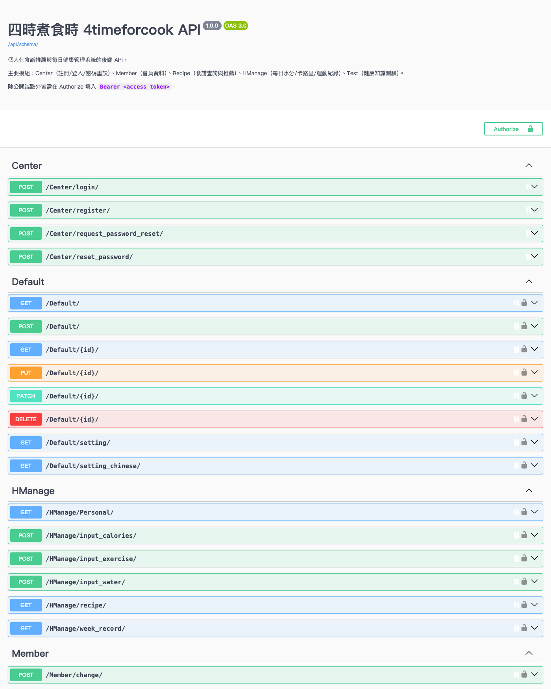
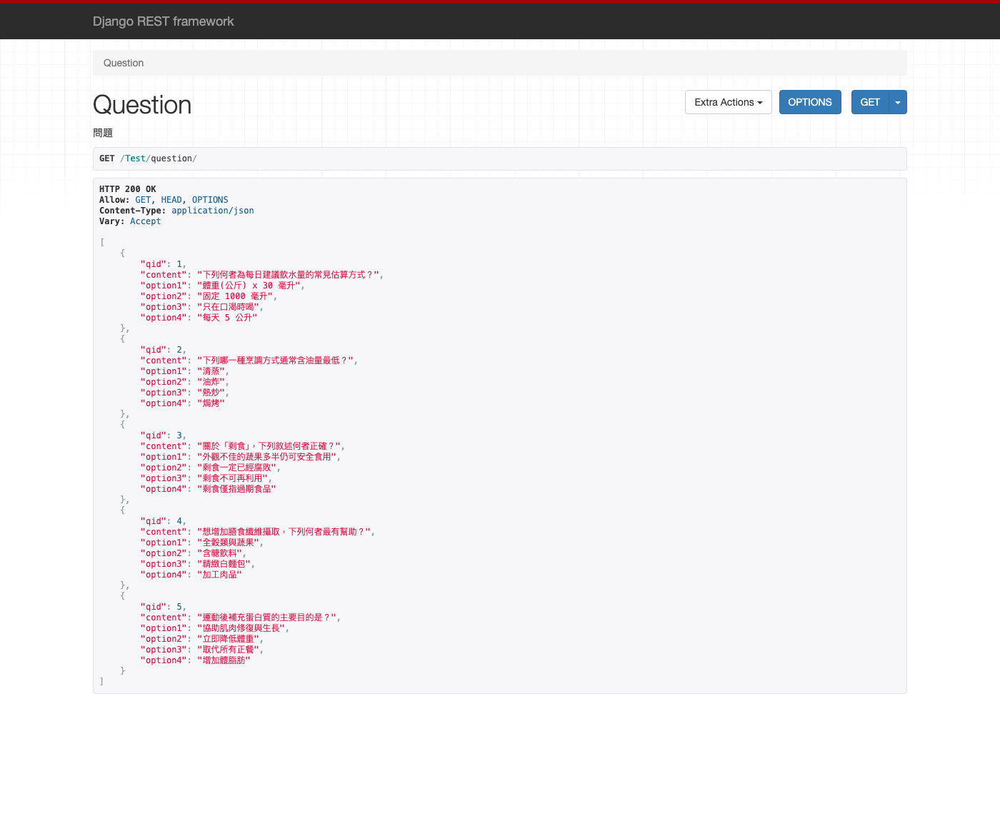

# 四時煮食時 4timeforcook — 後端 API

> 個人化食譜推薦 × 每日健康管理 × 剩食利用的 Django REST API。
> 這個 repo 是整個系統的**後端**；前端與 BERT 模型訓練另有獨立 repo。

[](https://www.djangoproject.com/)
[](https://www.django-rest-framework.org/)
[](https://www.python.org/)
[](#測試)

---

## 這個專案在做什麼？

現代人每天最花時間的決定之一，是「今天要吃什麼」。
**四時煮食時**把傳統的「食譜查詢網站」變成「個人化的食譜推薦」：

1. 使用者註冊時填寫身高體重、運動習慣、慢性病與飲食偏好。
2. 系統用**規則引擎**由 BMI 推導出每日的熱量／水分／運動目標。
3. 食譜端用 **BERT 命名實體辨識**把使用者輸入的自然語言（例如「我想用雞胸肉做 30 分鐘內的低鈉料理」）拆成食材、時間、健康標籤等查詢條件，再回推薦食譜。
4. 每日健康管理讓使用者記錄飲水、卡路里、運動，並統計一週達成率。
5. 剩食主題的知識測驗（前測／後測）用來衡量使用者對剩食議題的認知變化。

核心理念：**不訂外食、不浪費剩食**。外觀不討喜但仍安全的蔬果不該被丟掉，
透過個人化推薦讓這些食材找到用途，食物不浪費就是資源不浪費。

## 技術棧

| 層 | 使用技術 |
| --- | --- |
| Web 框架 | Django 5.1 + Django REST Framework |
| 認證 | JWT（`djangorestframework-simplejwt`），自訂 User model `Member.MemberP` |
| API 文件 | drf-spectacular（OpenAPI 3 + Swagger UI） |
| 資料庫 | 預設 SQLite；設定 `DB_ENGINE=mysql` 可切換 MySQL |
| 規則引擎 | 純 Python 規則模組（`HealthManage/expert/`） |
| NLP | BERT Token Classification（PyTorch + HuggingFace transformers，選用） |
| 測試 | pytest + pytest-django |

## 架構總覽

```
KBQA_Meibuy/          # Django 專案設定：settings、urls、JWT、CORS、OpenAPI
├── Member/           # 會員：註冊、登入、密碼重設、個人資料
│   └── models.py     #   MemberP(帳密) / Member(基本資料) / Health / Prefer
│                     #   HealthTarget(每日目標) / InputRecord(每日彙總)
├── HealthManage/     # 每日健康管理
│   ├── views.py      #   飲水 / 卡路里 / 運動的輸入與統計
│   ├── Controller.py #   由身高體重算 BMI → 推導每日目標
│   └── expert/       #   規則模組：飲食目標、慢性病飲食、搜尋參數轉換
├── recipe/           # 食譜
│   ├── DB_query.py   #   把查詢條件組成 Django ORM 的 Q 物件
│   ├── BertModel/    #   BERT NER：自然語言 → 查詢條件（選用，需 ML 相依）
│   └── Sourcedata/   #   原始食譜資料匯入與翻譯工具（離線使用）
└── Record/           # 紀錄與知識測驗
    ├── views.py      #   題庫輸出、計分、作答紀錄
    └── management/commands/seed_demo.py   # 展示資料種子
```

請求流程（以每日健康管理為例）：

```
前端 → JWT 驗證 → DailyViewsets.input_water
                    → DailyWaterSerializer 寫入單筆紀錄
                    → InputRecord 累加當日總量
     → DailyViewsets.Personal
                    → 讀取當日紀錄 + HealthTarget → 回傳達成率與剩餘量
```

## 快速開始（60 秒把 API 跑起來）

需求：**Python 3.12+**。預設使用 SQLite，不需要安裝任何資料庫。

```bash
git clone <this-repo> && cd backend

python3 -m venv .venv
source .venv/bin/activate          # Windows: .venv\Scripts\activate
pip install -r requirements-dev.txt

cp .env.example .env               # 預設值即可直接跑（DJANGO_DEBUG=1 + SQLite）

python manage.py migrate
python manage.py seed_demo         # 建立展示用題庫與示範會員
python manage.py runserver
```

開啟 <http://127.0.0.1:8000/api/docs/> 就能看到完整的 Swagger UI 並直接打 API。

`seed_demo` 會建立一組示範帳號（**純虛構資料**）：

| 帳號 | 密碼 |
| --- | --- |
| `demo` | `Demo!4time2024` |

拿到 token 之後即可操作需登入的端點：

```bash
# 1. 登入取得 JWT
TOKEN=$(curl -s -X POST http://127.0.0.1:8000/Center/login/ \
  -H "Content-Type: application/json" \
  -d '{"account":"demo","password":"Demo!4time2024"}' | python3 -c "import sys,json;print(json.load(sys.stdin)['token'])")

# 2. 查看今日健康達成狀況
curl -s http://127.0.0.1:8000/HManage/Personal/ -H "Authorization: Bearer $TOKEN"
```

實際回應：

```json
{
  "week": {"1": 1, "2": 1, "3": 2, "4": 2, "5": 2, "6": 2, "7": 1},
  "record": {
    "water_target": 3000, "water_now": 1200, "water_remain": 1800,
    "calories_target": 2000, "calories_now": 680, "calories_remain": 1320,
    "exercise_target": 300, "exercise_now": 125, "exercise_remain": 175
  }
}
```

知識測驗是公開端點，不需登入：

```bash
curl -s http://127.0.0.1:8000/Test/question/
curl -s -X POST http://127.0.0.1:8000/Test/check/ \
  -H "Content-Type: application/json" \
  -d '[{"qid":1,"answer":"A","is_post_test":false},
       {"qid":2,"answer":"B","is_post_test":false}]'
# => {"score":50,"wrong_question":[2]}
```

## 介面預覽

因為這是純後端專案，「可以看到的介面」就是 API 本身。
以下畫面在跑完上面的快速開始後都能直接重現。

### Swagger UI — `/api/docs/`



### DRF 瀏覽介面 — `/Test/question/`



前端（Vue）畫面請見前端 repo。

## 主要 API

| 端點 | 方法 | 需登入 | 說明 |
| --- | --- | --- | --- |
| `/Center/register/` | POST | ✗ | 註冊（同時建立會員、健康、偏好資料與每日目標） |
| `/Center/login/` | POST | ✗ | 登入，回傳 JWT access token |
| `/Center/request_password_reset/` | POST | ✗ | 申請密碼重設（不洩漏帳號是否存在，5 次/小時） |
| `/Center/reset_password/` | POST | ✗ | 以 uid + token 重設密碼 |
| `/api/token/refresh/` | POST | ✗ | 以 refresh token 換發 access token |
| `/Member/info/` | GET | ✓ | 取得自己的會員資料 |
| `/Member/change/` | POST | ✓ | 修改自己的會員資料 |
| `/HManage/Personal/` | GET | ✓ | 今日達成率與本週狀態 |
| `/HManage/input_water/` | POST | ✓ | 記錄飲水量 |
| `/HManage/input_calories/` | POST | ✓ | 記錄卡路里 |
| `/HManage/input_exercise/` | POST | ✓ | 記錄運動（強度 × 時間加權） |
| `/HManage/week_record/` | GET | ✓ | 本週每日彙總 |
| `/Recipe/example_output/` | GET | ✗ | 食譜範例輸出 |
| `/Recipe/get/` | POST | ✓ | 依查詢條件推薦食譜 |
| `/Test/question/` | GET | ✗ | 知識測驗題庫（不含正解） |
| `/Test/check/` | POST | ✗ | 送出作答並計分 |

完整清單與 request/response schema 請見 `/api/docs/`。

## 測試

```bash
pip install -r requirements-dev.txt
pytest
```

測試會自動使用 SQLite（見 `pytest_env_setup.py`），不會碰到 MySQL，
也不會載入 torch / transformers。目前 **82 個測試全數通過**，涵蓋：

- `Member/tests.py` — 授權與 IDOR 防護、密碼雜湊與強度驗證、登入、
  不洩漏帳號存在與否的密碼重設流程、註冊後自動建立每日目標。
- `Record/tests.py` — 題庫不外洩正解、計分規則（全對／部分錯／全錯）、
  空 body 與不存在題號回 4xx 而非 500。
- `HealthManage/tests.py` — 端點需登入、輸入欄位驗證、當日累計、
  運動強度加權、達成率統計、時區邊界（凌晨紀錄仍算今天）。
- `HealthManage/test_rules.py` — BMI 分級邊界、慢性病飲食規則、
  搜尋參數轉換、由身高體重推導每日目標。
- `recipe/tests.py` — 前端條件轉查詢參數（標籤／時間／健康因素）、
  查詢參數組成 ORM 的 Q 物件與上下界條件。

## 環境變數

複製 `.env.example` 成 `.env` 後調整。開發模式下全部都有可用的預設值。

| 變數 | 說明 |
| --- | --- |
| `DJANGO_DEBUG` | `1` 開啟 debug；其他值為關閉 |
| `DJANGO_SECURE` | Django SECRET_KEY，**關閉 debug 時必填**，否則啟動即報錯 |
| `DJANGO_ALLOWED_HOSTS` | 逗號分隔的允許網域 |
| `DB_ENGINE` | `sqlite`（預設）或 `mysql` |
| `SERVER_DATABASE` / `SERVER_USER` / `SERVER_PWD` / `SERVER_IP` / `SERVER_PORT` | 僅在 `DB_ENGINE=mysql` 時使用 |

`.env` 已列在 `.gitignore`，repo 內不含任何真實憑證。

## 選用功能：BERT 食譜查詢與資料匯入

自然語言查詢與食譜資料匯入需要額外的 ML 相依套件（torch、transformers 等），
這些 import 都寫在函式內部，**不裝也不影響 Web API 正常運作**：

```bash
pip install -r requirements-ml.txt
```

模型權重 `recipe/BertModel/model.pth` 因檔案過大未納入版本控制。

## 安全性設計

- 自訂 User model，密碼一律經 Django hasher 雜湊儲存，並套用密碼強度驗證器。
- DRF 預設權限為 `IsAuthenticated`，公開端點才個別放行。
- 移除了會員資料的 IDOR 路由，個人資料一律以登入者身分取用。
- 密碼重設採 token 制並加上 5 次/小時的節流，且不因帳號是否存在而回應不同內容。
- 破壞性的資料庫初始化端點限制為管理員專用。
- 關閉 DEBUG 時自動啟用 HSTS、SSL redirect、Secure cookie、`X-Frame-Options: DENY` 等標頭。
- `DJANGO_SECURE` 未設定且 DEBUG 關閉時直接拒絕啟動，避免用到預設金鑰上線。

## 授權

本 repo 目前尚未附上授權條款（LICENSE）檔案，預設保留所有權利。
若要開放他人使用，請自行加入合適的授權條款。
